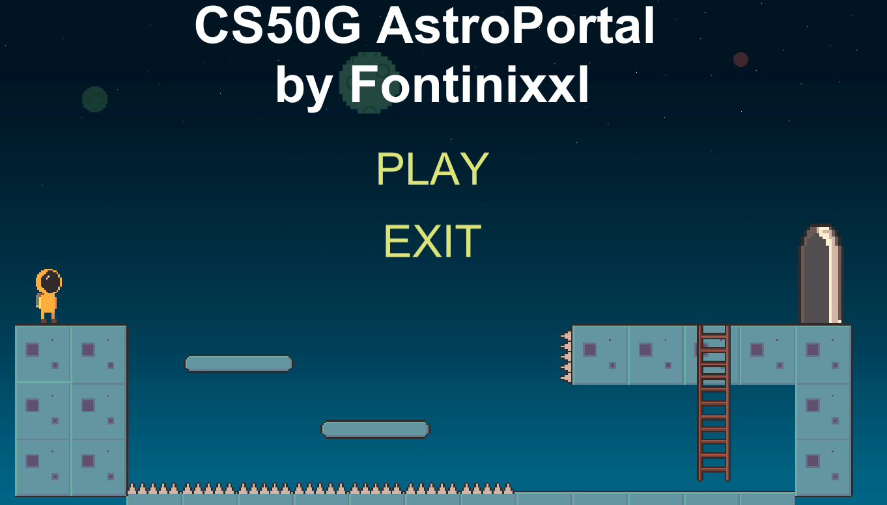
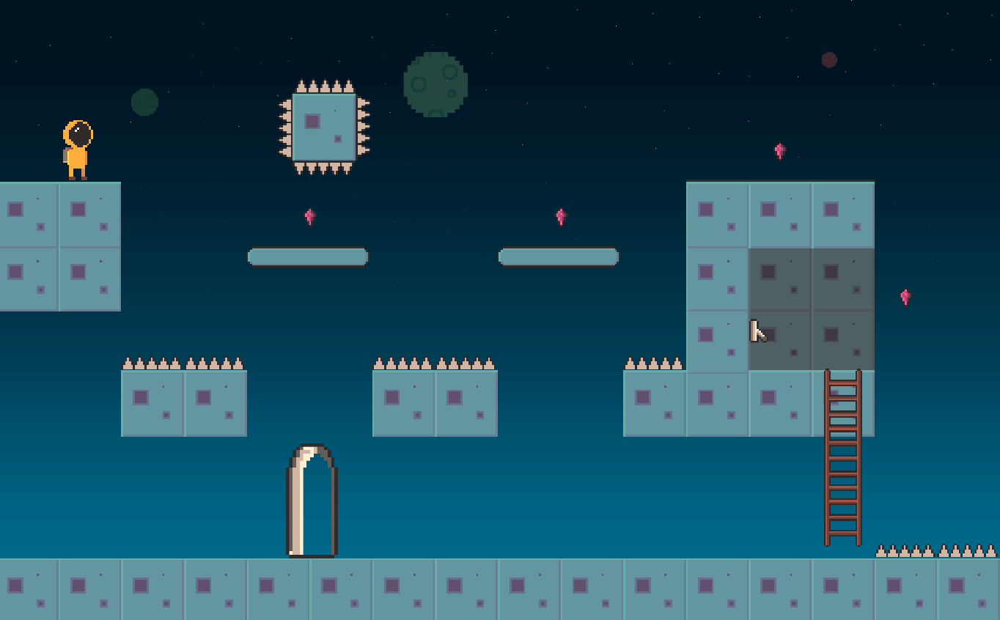

# AstroPortal
My first Unity Game submitted as the final project of CS50G Introduction to Game Development course offered by HardvardX 

## Game
AstroPortal is a simple 2D platformer game using PixelArt. Your goal is to complete all the levels, in which you have to reach the corresponding portal.
In the second level, in order to open the portal, you will have to switch on the lever.
This is a prototype Demo, so there are only 2 levels available and a Credit Screen.

### Art
For the art I used the [Free Pixel Space Platform Pack](https://assetstore.unity.com/packages/2d/characters/free-pixel-space-platform-pack-146318) from the Unity Asset Store.

## Development
The game is made using Unity 2019.2.12f1.

For the Level design, I used the Tile Palette with different layers.

The character is using a simple Dynamic RigidBoby for the movement and 2D colliders.

## ScreenShots

## Bugs
Right now there are a bunch of bugs present in the game:
* Buttons on the menu don't work properly; in the second level they don't respond at all.
* When the player falls (level1) from either side of the map, it will fall forever xD
* Glich with the animation when reaching the top of the ladder.
